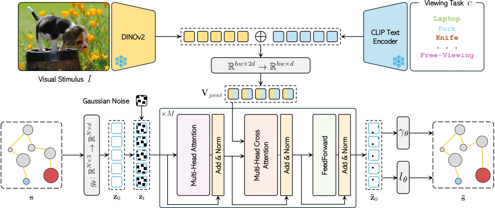

<p align="center">
  
  
</p>

<div align="center">
  
# Modeling Human Gaze Behavior with Diffusion Models for Unified Scanpath Prediction

[**Giuseppe Cartella**](https://scholar.google.com/citations?hl=en&user=0sJ4VCcAAAAJ),
[**Vittorio Cuculo**](https://scholar.google.com/citations?hl=en&user=usEfqxoAAAAJ&hl=it&oi=ao),
[**Alessandro D'Amelio**](https://scholar.google.com/citations?user=chkawtoAAAAJ&hl=en&oi=ao),<br>
[**Marcella Cornia**](https://scholar.google.com/citations?hl=en&user=DzgmSJEAAAAJ),
[**Giuseppe Boccignone**](https://scholar.google.com/citations?user=LqM0uJwAAAAJ&hl),
[**Rita Cucchiara**](https://scholar.google.com/citations?hl=en&user=OM3sZEoAAAAJ)

Official implementation of "Modeling Human Gaze Behavior with Diffusion Models for Unified Scanpath Prediction", ICCV 2025 🌺

</div>

## Overview

<p align="center">
    
</p>

>**Abstract**: <br>
> Predicting human gaze scanpaths is crucial for understanding visual attention, with applications in human-computer interaction, autonomous systems, and cognitive robotics. While deep learning models have advanced scanpath prediction, most existing approaches generate averaged behaviors, failing to capture the variability of human visual exploration. In this work, we present ScanDiff, a novel architecture that combines diffusion models with Vision Transformers to generate diverse and realistic scanpaths. Our method explicitly models scanpath variability by leveraging the stochastic nature of diffusion models, producing a wide range of plausible gaze trajectories. Additionally, we introduce textual conditioning to enable task-driven scanpath generation, allowing the model to adapt to different visual search objectives. Experiments on benchmark datasets show that ScanDiff surpasses state-of-the-art methods in both free-viewing and task-driven scenarios, producing more diverse and accurate scanpaths. These results highlight its ability to better capture the complexity of human visual behavior, pushing forward gaze prediction research.

## Code coming soon

## Citation

If you find this work useful for your research, please cite our paper:

```bibtex
@inproceedings{cartella2025modeling,
  title={Modeling Human Gaze Behavior with Diffusion Models for Unified Scanpath Prediction},
  author={Cartella, Giuseppe and Cuculo, Vittorio and D'Amelio, Alessandro and Cornia, Marcella and Boccignone, Giuseppe and Cucchiara, Rita},
  booktitle={Proceedings of the IEEE/CVF International Conference on Computer Vision},
  year={2025}
}
```
